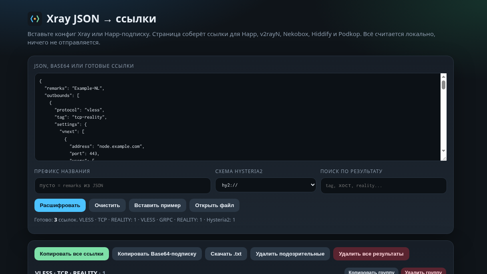

# Xray JSON → ссылки

Одна страница в браузере: вставляешь JSON из Happ или Xray и забираешь обычные ссылки для других клиентов.

## Почему это появилось?

Сначала всё было проще: подписка приходила списком ссылок, и её можно было открыть где угодно. Потом многие сервисы стали отдавать подписку только в Happ. В самом Happ она выглядит нормально, а если заглянуть внутрь, это один JSON с кучей серверов сразу.

Такой кусок неудобно тащить в другой клиент. В v2rayN, Nekobox, Hiddify и на роутере с Podkop нужна отдельная ссылка, а не весь конфиг. Сначала я переписывал их руками: вытаскивал адрес, порт, UUID, Reality-ключ и собирал `vless://` или `hy2://`. На пачке серверов это быстро надоедает, а мусорные узлы в той же подписке только мешают.

Отсюда и этот локальный инструмент. Он разбирает JSON, собирает ссылки, раскладывает их по протоколам и даёт выкинуть лишнее до того, как копировать или скачивать файл.

## Как выглядит?

## Что делает?

Из `outbounds` получаются `vless://`, `vmess://`, `trojan://`, `ss://` и `hy2://`. Ссылки можно скопировать все сразу, одной группой, скачать `.txt` или забрать Base64-подпиской. Отдельную строку или целую группу можно удалить. Узлы с битым адресом или без Reality public key помечаются, их убирает кнопка «Удалить подозрительные».

Разбор идёт только в браузере. Конфиг, UUID и ключи никуда не отправляются.

## Как открыть?

- Скачать репозиторий и открыть `index.html`.
- Или открыть `https://n3tr4z0r.github.io/xray-to-links/`.

## Что понимает?

- Полный конфиг Xray с `outbounds`.
- Один outbound или массив outbound’ов без обёртки.
- JSONC: комментарии `//`, `/* */` и висячие запятые.
- Base64 от JSON или от списка ссылок.
- Уже готовые строки `vless://`, `hy2://`, `hysteria2://`, `trojan://`, `ss://`, `vmess://`: их можно почистить и выгрузить заново.
- Перетаскивание `.json` / `.txt` в поле.

Протоколы: VLESS (TCP / WS / gRPC / xHTTP / HTTP / Reality / TLS), VMess, Trojan, Shadowsocks, Hysteria2. Hysteria 1 не маскируется под hy2, для неё собирается отдельная ссылка. `freedom`, `blackhole`, `dns` и прочие служебные outbound`ы пропускаются.

## Кнопки

- Расшифровать, очистить, пример, открыть файл.
- Префикс названия вместо `remarks` из JSON.
- Схема `hy2://` или `hysteria2://`.
- Поиск по уже собранному списку.
- Копировать всё, копировать группу, Base64-подписка, скачать `.txt`.
- Удалить одну ссылку, группу или все узлы с подозрительным адресом / без Reality public key.

`Ctrl+Enter` в поле ввода также запускает разбор. Вставка сама запускает разбор.